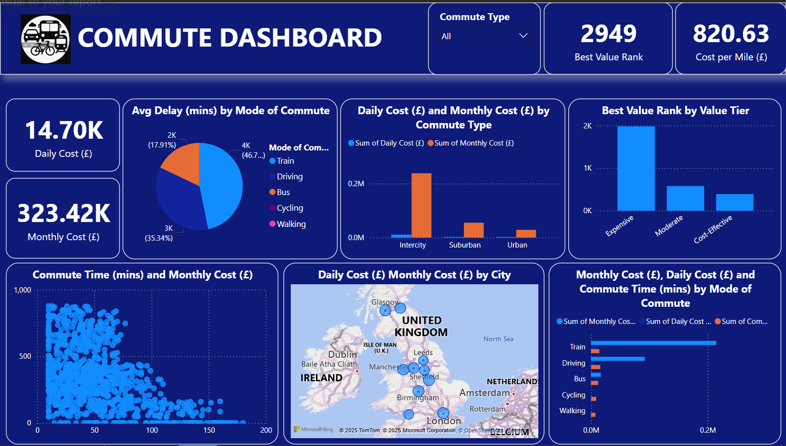

## 🚦 UK Commute Cost Efficiency Analysis

 
A comprehensive data analytics project assessing daily and monthly commute costs, transport efficiency, and city-by-city trends across the United Kingdom. Built using SQL, Excel-based statistical testing, and Power BI dashboards, the project delivers actionable insights to inform cost optimization and urban mobility decisions.

## 📘 Project Overview

This project analyzes transportation costs, delays, and environmental impact across major UK cities. By integrating structured datasets with public cost benchmarks, the analysis provides critical insights into commuter behavior, city-level inefficiencies, and potential areas for mobility improvement.

## 🔍 Objectives
- Clean and structure commute datasets for analysis
- Analyze cost efficiency across different modes of transport
- Benchmark cities based on delays and carbon impact
- Categorize commute cost and distance tiers
- Conduct statistical testing (ANOVA) on mode-based cost differences
- Visualize trends using an interactive Power BI dashboard

## 🧰 Tools Used
- SQL: Preprocessing, transformation, and aggregate analysis
- Microsoft Excel: ANOVA, statistical validation
- Power BI: Dashboard development and executive visualization

_You can access the Datasets file_ [here](https://github.com/sameera-explores-data/UK-Commute-Cost-Efficiency-Analysis/blob/main/cleaned_commute_costs.csv) 

----
## 🗃️ Dataset Cleaning, Structuring and Analysis using SQL
- Missing Values: No null values detected across features
- Standardization: Unified column names and SQL-compatible date formats
- Data Types: Converted appropriate fields for query efficiency
- Outlier Detection: No irregular values detected
- Average cost per mode of transport: Train is the most expensive mode. While it may be faster for long distances, it comes at a high financial cost.
- Top 5 routes by best value rank: From the result, the top 5 commute route by best value rank are:
Bath - Bristol, Beeston - Nottingham, Birkenhead - Liverpool, East Kilbride - Glasgow, and Bradford - Leeds.
- Compare daily vs monthly commute costs by city: Overall, commuting is most expensive in Nottingham and cheapest in Leeds on average.

_You can access the SQL file_ [here](https://github.com/sameera-explores-data/UK-Commute-Cost-Efficiency-Analysis/blob/main/Commute_Queries.sql)

## 📊 Statistical Analysis (Excel ANOVA)
- Hypothesis 1: Train commutes are significantly more expensive than driving across UK cities.
- Statistical test: t-test or ANOVA comparing Daily Cost (£) by Mode of Commute

-- In Conclusion: The cost difference is statistically significant. Train travel is consistently more expensive than driving across UK cities.

## 📊 Power BI Dashboard Highlights

This Commute Dashboard shows detailed insights about commuting patterns, cost, and time across different modes of transport and locations in the UK. 

# Features
- Commute cost breakdown by mode, city, and distance category
- Delay analysis and carbon impact visualizations
- Commute time vs monthly cost scatterplots
- Value-tier classification showing cost-effective and expensive routes
- City map displaying geographic variation in commuting costs

_You can access and interact with the Power BI dashboard_ [here](https://github.com/sameera-explores-data/UK-Commute-Cost-Efficiency-Analysis/blob/main/Commute%20Dashboard.pbix)

---
## Conclusions

The analysis reveals significant differences in commute costs and efficiency across UK cities and transport modes. Train travel is the most expensive and delay-prone, while walking and cycling are free and time-efficient. Nottingham has the highest overall costs, while Leeds is the most affordable. ANOVA results confirm that train commutes are significantly more expensive than driving.

## Recommendations

To improve cost-efficiency and reduce delays, cities should invest in affordable and reliable public transport alternatives, promote cycling and walking for short distances, and optimize intercity train pricing. Commuters should consider cost-effective routes like Beeston-Nottingham or Birkenhead-Liverpool for better value.

---
## 📂 Folder Structure
- Data # Cleaned and categorized commute data
- Sql # SQL scripts for preprocessing and aggregation
- Analysis # ANOVA and statistical interpretation
- Dashboards  # Power BI report files
- Reports # PDF summaries, visuals, and insights
- README.md # Project summary and documentation

## 🚀 How to Use
1. Download the `.pbix` file (Power BI file) from the repository.
2. Open with Power BI Desktop.
3. Connect to the provided Excel data source.
4. Explore the dashboard visuals and adjust filters as needed.

## 📝 Report Summary

A detailed written report is included in this repo (`Commute_Project_Report.pdf`), summarizing all analytical findings and strategic recommendations for business optimization. 

[Commute_Project_Report.pdf](https://github.com/sameera-explores-data/UK-Commute-Cost-Efficiency-Analysis/blob/main/Commute_Project_Report.pdf)

## 📌 Note
If you find this project insightful, feel free to star ⭐ the repo or connect with me for freelance collaborations or dashboard development projects.

---

